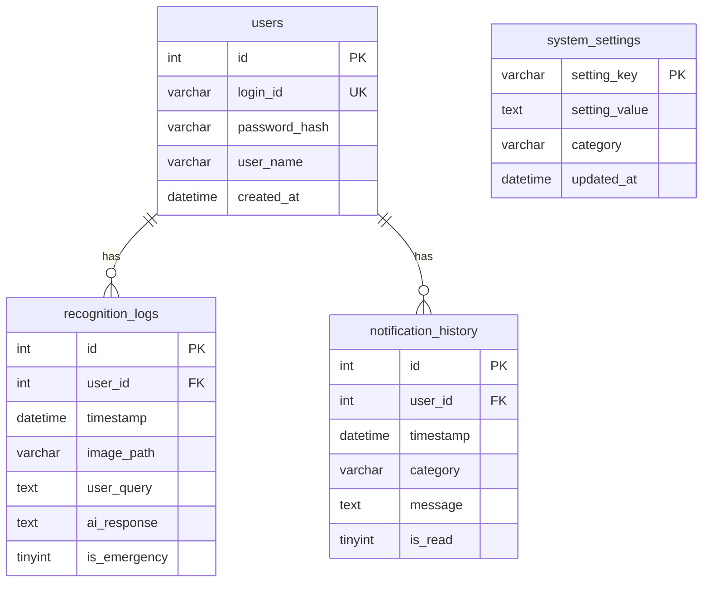

# データベース設計書 — コエミマ（MySQL）

| 項目 | 内容 |
|---|---|
| DBMS | MySQL 8.0（`utf8mb4` / `utf8mb4_unicode_ci`） |
| 命名規則 | テーブル・カラムは snake_case |
| バージョン | 1.0 |
| 更新日 | 2026-07-09 |

すべてのデータを Ubuntu サーバー上の MySQL で一括管理する。エッジ（Raspberry Pi 5）で発生した認識イベントはサーバー経由で保存される。テーブルはアプリ起動時に `init_db()`（SQLAlchemy の `create_all`）で自動作成され、`sql/schema.sql` でも同等の定義を提供する。

---

## 1. ER 図

---

## 2. テーブル定義

### 2.1 users（ユーザー管理）
補助者のログイン情報・表示名を管理。

| カラム名 | 型 | 制約 | 説明 |
|---|---|---|---|
| id | INT | PK, AUTO_INCREMENT | ユーザーID |
| login_id | VARCHAR(255) | UNIQUE, NOT NULL | 電話番号またはメールアドレス |
| password_hash | VARCHAR(255) | NOT NULL | ハッシュ化パスワード（Werkzeug） |
| user_name | VARCHAR(100) | | 表示名 |
| created_at | DATETIME | DEFAULT CURRENT_TIMESTAMP | 登録日時 |

### 2.2 recognition_logs（認識・対話ログ）
Gemini 解析結果の履歴。ダッシュボードの「履歴ログ」に表示。

| カラム名 | 型 | 制約 | 説明 |
|---|---|---|---|
| id | INT | PK, AUTO_INCREMENT | ログID |
| user_id | INT | NOT NULL, FK(users.id) ON DELETE CASCADE | ユーザーID |
| timestamp | DATETIME | DEFAULT CURRENT_TIMESTAMP | 発生日時 |
| image_path | VARCHAR(500) | | 画像の保存先パス |
| user_query | TEXT | | 音声認識された質問内容 |
| ai_response | TEXT | | AIの回答内容 |
| is_emergency | TINYINT(1) | DEFAULT 0 | 緊急判定（1:緊急, 0:通常） |

### 2.3 notification_history（通知・行動履歴）
家族への通知内容の履歴。

| カラム名 | 型 | 制約 | 説明 |
|---|---|---|---|
| id | INT | PK, AUTO_INCREMENT | 通知ID |
| user_id | INT | NOT NULL, FK(users.id) ON DELETE CASCADE | ユーザーID |
| timestamp | DATETIME | DEFAULT CURRENT_TIMESTAMP | 通知日時 |
| category | VARCHAR(50) | | 通知種別（fall_risk, medication, dangerous_object, other_emergency 等） |
| message | TEXT | | 通知メッセージ |
| is_read | TINYINT(1) | DEFAULT 0 | 既読フラグ |

### 2.4 system_settings（システム設定）
画面から変更可能なパラメータ（キー・バリュー方式）。

| カラム名 | 型 | 制約 | 説明 |
|---|---|---|---|
| setting_key | VARCHAR(100) | PK | 設定キー名 |
| setting_value | TEXT | | 設定値 |
| category | VARCHAR(50) | | 設定分類（notification 等） |
| updated_at | DATETIME | ON UPDATE CURRENT_TIMESTAMP | 最終更新日時 |

**現行で使用する設定キー：**
| setting_key | 既定値 | 意味 |
|---|---|---|
| notify_conversation_log | "1" | 会話ログのLINE送信 ON/OFF |
| notify_periodic | "0" | 定期通知 ON/OFF |
| keyword | "チャピー,起動して" | ウェイクワード（カンマ区切りで複数可） |
| user_name | "管理者" | ダッシュボードの表示名 |

---

## 3. 補足
- **ユーザー紐付け**：最初に登録したユーザーが `id=1` となり、認識ログは先頭ユーザーに紐づく（`getFirstUserId()`）。
- **画像本体**はDBに保存せず、サーバーの `/app/images` に保存し、`image_path` にパスのみを記録する。
