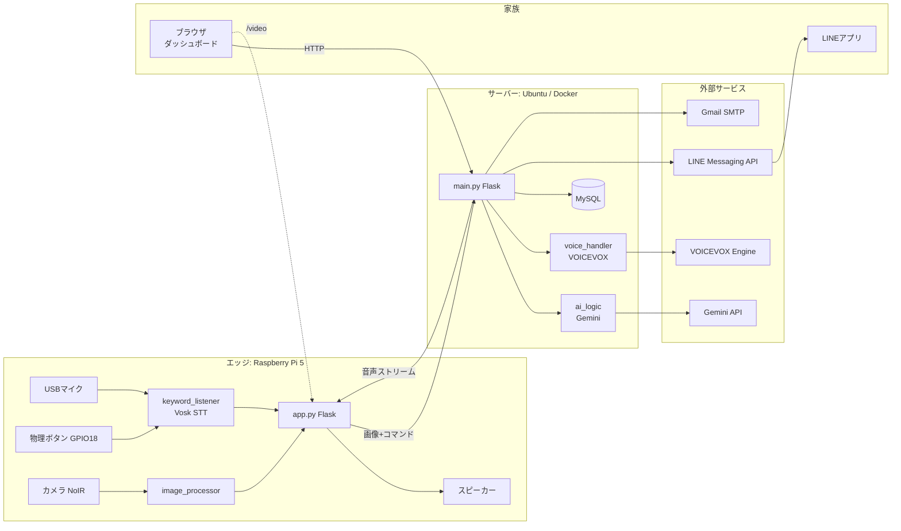
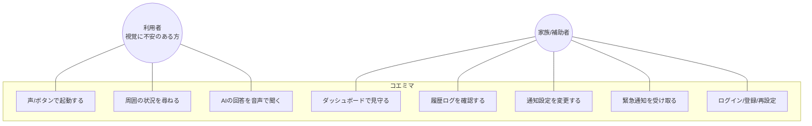
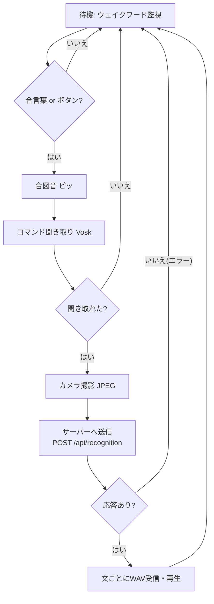

# 各種図（Mermaid） — コエミマ

フローチャート・ユースケース図・全体構成図・クラス図・シーケンス図・ER図を Mermaid で記述する。Markdown対応ビューア（GitHub, VS Code等）でそのまま図として表示できる。

---

## 1. 全体構成図

---

## 2. ユースケース図

---

## 3. フローチャート（エッジの認識フロー）

---

## 4. クラス図・シーケンス図・ER図
- クラス図・シーケンス図 → 「詳細設計/詳細設計書.md」
- 認識フローのシーケンス → 「基本設計/基本設計書.md 6章」
- ER図 → 「基本設計/SQL設計書.md」

> 画像（PNG）が必要な場合は、Mermaid を `mmdc`（mermaid-cli）や各種オンラインエディタでPNG/SVGに書き出せる。
