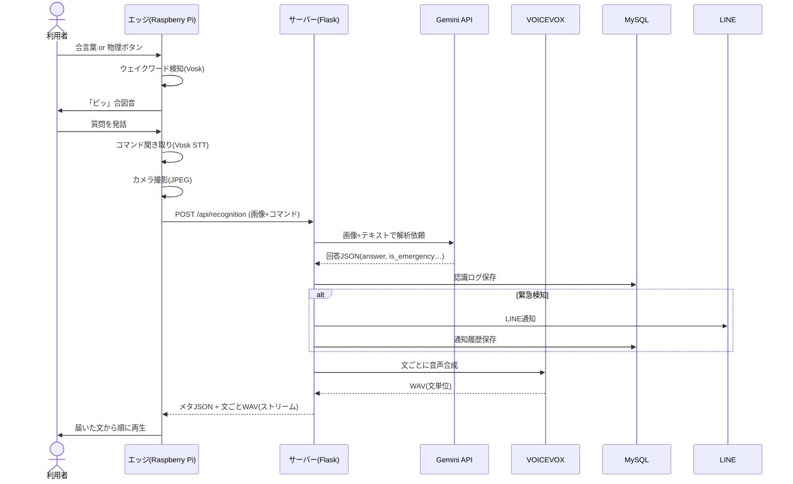

# 基本設計書 — コエミマ（AI見守りアシスタント）

| 項目 | 内容 |
|---|---|
| システム名 | コエミマ（声で見守るAIアシスタント） |
| バージョン | 2.0 |
| 更新日 | 2026-07-09 |
| 対象 | Raspberry Pi 5（エッジ）＋ Ubuntu サーバー（管理・処理集約） |

---

## 1. システム概要

### 1.1 背景と目的
視覚に不安のある方や離れて暮らす高齢者が、**声だけ**で周囲の状況を確認し、家族が遠隔から見守れる環境を提供する。難しい機器操作を必要とせず、危険を検知した際は家族へ自動で通知する。

### 1.2 ターゲットユーザー
- **メインユーザー**：視覚に不安のある方／見守り対象の高齢者
- **サブユーザー（補助者）**：離れて暮らす家族・介護補助者

### 1.3 全体構成
Raspberry Pi 5（エッジ）と Ubuntu サーバーを組み合わせたハイブリッド構成。

- **エッジ（Raspberry Pi 5）**：撮影・音声入出力・ウェイクワード検知・物理ボタンなど「体」の役割に専念（軽量）。
- **サーバー（Ubuntu / Docker）**：AI解析・音声合成・DB・通知・管理画面など「脳」の役割を集約（重い処理）。
- **家族**：ブラウザのダッシュボードと LINE で見守る。

AI解析（Gemini）と音声合成（VOICEVOX）はサーバーに集約し、Pi5 の CPU 負荷軽減と応答速度向上を図る。音声認識（Vosk）はエッジ側でローカルに完結する。

---

## 2. システム構成

### 2.1 ハードウェア構成
「使用技術.md」を参照。要点：Raspberry Pi 5＋カメラモジュール（NoIR）＋USBマイク＋USBスピーカー＋物理プッシュボタン（GPIO18）。サーバーは Ubuntu 24.04 LTS の常時起動機。

### 2.2 ソフトウェア構成
「使用技術.md」を参照。要点：
- エッジ：Python 3.11 / Vosk（STT）/ OpenCV・Picamera2（撮影）/ Flask（命令待受・映像配信）/ gpiozero（ボタン）
- サーバー：Python 3.11 / Flask（API・画面）/ Google Gemini API（AI）/ VOICEVOX（TTS）/ MySQL 8.0（DB）/ Docker Compose

---

## 3. 機能設計

### 3.1 サーバー（Ubuntu）
- **3.1.1 管理ダッシュボード提供**：補助者がブラウザでリアルタイム映像・認識ログ・通知履歴を確認。PCは統合レイアウト、スマホはレスポンシブ対応。
- **3.1.2 認証・アカウント管理**：ID/パスワード認証（ハッシュ保存）、新規登録、パスワード再設定（メール認証コード）、ログイン時のメール2段階認証（SMTP設定時）。
- **3.1.3 AI状況解析**：エッジから受け取った画像＋発話テキストを Gemini 2.5 Flash に渡し、状況の言語化と緊急度判定を行う。
- **3.1.4 音声合成（TTS）**：AIの回答を VOICEVOX で音声化。**文単位でストリーミング返却**し、最初の一文から即再生できるようにする。
- **3.1.5 中央データ管理（MySQL）**：認識ログ（画像パス・質問・回答・緊急フラグ）、通知履歴、システム設定を永続化。
- **3.1.6 通知**：緊急検知時に家族の LINE へ自動通知。設定により通常時の会話ログ送信・定期通知も可能。
- **3.1.7 エッジ連携**：ハートビート応答、ウェイクワード設定の配信（`/api/edge-config`）。

### 3.2 エッジ（Raspberry Pi 5）
- **3.2.1 オフライン常時ウェイクワード監視**：Vosk により「チャピー」「起動して」等を完全ローカルで常時監視。表記ゆれ吸収（カタカナ→ひらがな正規化＋あいまい一致）と発話途中(partial)検知で精度を確保。
- **3.2.2 物理ボタン起動**：GPIO18 の物理ボタンでも即時起動可能（音声が拾えない場面の確実な起動手段）。
- **3.2.3 コマンド聞き取り（STT）**：ウェイクワード後、Vosk で利用者の発話をテキスト化。RMSベースの無音終端判定で早期に打ち切る。
- **3.2.4 カメラ制御・前処理**：Picamera2＋OpenCV で撮影。NoIRカメラの青み補正（R-B入れ替え）を実施し JPEG 化。
- **3.2.5 サーバー通信**：撮影画像＋発話テキストを `/api/recognition` へ送信し、返却された音声（WAV）を順次再生。
- **3.2.6 リアルタイム映像配信**：`/video`（MJPEG）でダッシュボードにライブ映像を提供。

### 3.3 外部サービス連携
- **3.3.1 Google Gemini API（2.5 Flash）**：画像＋テキストのマルチモーダル解析。回答・緊急フラグ・カテゴリを構造化JSONで取得。
- **3.3.2 LINE Messaging API**：家族へのプッシュ通知。
- **3.3.3 Gmail SMTP**：認証コード（パスワード再設定・ログイン2段階）のメール送信。

音声認識（STT）はエッジの Vosk で行う。エッジ⇔サーバー間は同一LAN内での通信を前提とする。

---

## 4. 画面設計
「画面/画面設計書.md」を参照。主要画面：ログイン、新規登録、パスワード再設定（3ステップ）、ダッシュボード、履歴ログ、通知・詳細設定。

---

## 5. データ設計
「基本設計/SQL設計書.md」を参照。テーブル：`users` / `recognition_logs` / `notification_history` / `system_settings`。

---

## 6. 処理フロー（音声認識〜応答）

---

## 7. 非機能要件（現状と課題）
| 分類 | 現状 | 今後の課題 |
|---|---|---|
| 応答速度 | 文単位ストリーミングで体感短縮 | Geminiの応答時間依存 |
| 精度 | 表記ゆれ吸収・partial検知・ノイズゲート | 大規模Voskモデル／実在語キーワード推奨 |
| 可用性 | ハートビート監視、依存欠落時フォールバック | 冗長化なし |
| セキュリティ | パスワードハッシュ・画像配信は認証必須 | API認可・HTTPS・登録制限（「セキュリティ設計書.md」参照） |
| 保守性 | クラス分割・Docker化 | 本番WSGI化・画像世代管理 |
