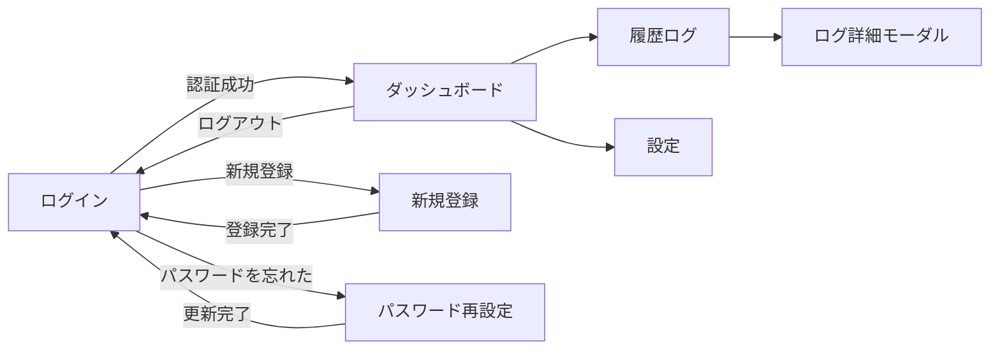

# 画面設計書 — コエミマ

| 項目 | 内容 |
|---|---|
| バージョン | 2.0 |
| 更新日 | 2026-07-09 |
| 対象 | 補助者（家族）向け Web 管理画面 |

システム名は画面ヘッダーに「コエミマ」を表示。レスポンシブ対応（768px基準でPC/スマホ切替）。

---

## 1. 画面一覧

| 画面ID | 画面名 | パス | 種別 | 概要 |
|---|---|---|---|---|
| SC-01 | ログイン | `/login` | 全画面 | ID/パスワード認証。メール2段階、再設定・登録リンク |
| SC-02 | 新規登録 | `/register` | 全画面 | 名前・ID・パスワードで登録 |
| SC-03 | パスワード再設定 | `/forgot` | 全画面（3ステップ） | メール→コード→新パスワード |
| SC-04 | ダッシュボード | `/` | 全画面 | リアルタイム映像＋最新AI応答＋履歴ログ |
| SC-05 | 履歴ログ | `/logs` | 全画面 | 認識履歴一覧、行クリックで詳細モーダル |
| SC-06 | 通知・詳細設定 | `/settings` | 全画面 | トグル設定・ウェイクワード・表示名 |
| SC-07 | ログ詳細 | （モーダル） | モーダル | 認識画像＋AI回答全文 |

---

## 2. 画面遷移

---

## 3. 画面詳細

### SC-01 ログイン
- 入力：ログインID（メール/電話）、パスワード
- ボタン：ログイン
- リンク：新規登録（右上）、パスワードを忘れた場合
- 挙動：認証成功かつメール宛＆SMTP設定時は**確認コード入力フォームに切替**（2段階）。
- バリデーション：未入力「必須項目を入力してください」／認証失敗「IDまたはパスワードが正しくありません」

### SC-02 新規登録
- 入力：表示名、ログインID、パスワード、パスワード（確認）
- バリデーション：必須、8文字以上、確認一致、重複ID不可
- 成功で `/login` へ

### SC-03 パスワード再設定（3ステップ）
1. メールアドレス入力 → 確認コード送信
2. 4桁コード入力 → 検証（5分有効）
3. 新パスワード＋確認 → 更新 → `/login` へ

### SC-04 ダッシュボード
- 左：サイドナビ（ダッシュボード／履歴ログ／通知設定／ログアウト）
- 中央上：リアルタイム映像（`EDGE_URL/video` を埋め込み）
- 中央下：最新のAI応答（質問・日時・緊急/通常バッジ・回答）
- 右：履歴ログ（タイムライン、クリックで詳細モーダル）
- 自動更新：約5秒ごとに `/api/dashboard` を再取得
- ヘッダー右上：表示名（設定の `user_name`）

### SC-05 履歴ログ
- 認識履歴の一覧（サムネイル＋質問＋日時＋バッジ）
- 行クリックで詳細モーダル（SC-07）
- 自動更新あり

### SC-06 通知・詳細設定
- トグル：会話ログ送信、定期的な通知
- 入力：ウェイクワード（カンマ区切りで複数可）、表示名
- 保存で `system_settings` に永続化。ウェイクワードはエッジへ同期（最大30秒）

### SC-07 ログ詳細モーダル
- 認識画像（`/images/...`）、質問、日時、緊急/通常バッジ、AI回答全文
- 背景クリック/×で閉じる

---

## 4. デザイン方針
- ユニバーサルデザイン（大きめ文字・高コントラスト）
- ブランド色：ティール系（#2f6fd6 系）、緊急は赤系
- スマホ時はサイドナビをボトムナビ相当に簡略化
- レスポンシブ化により、PC・スマホを1つの画面構成で提供する
