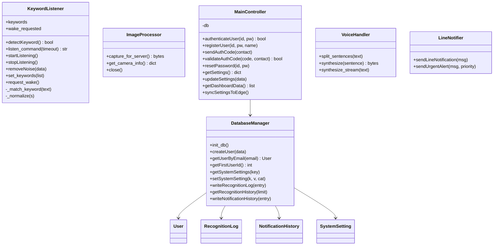
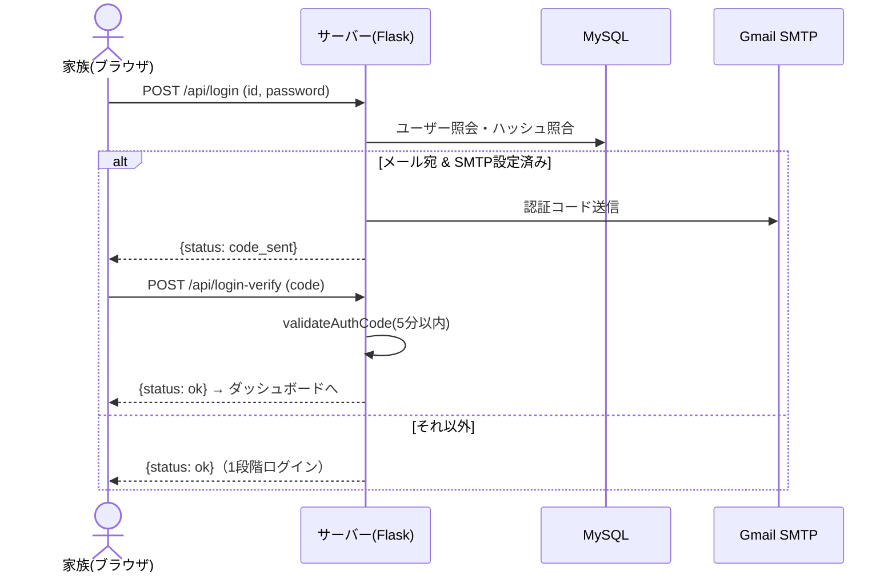
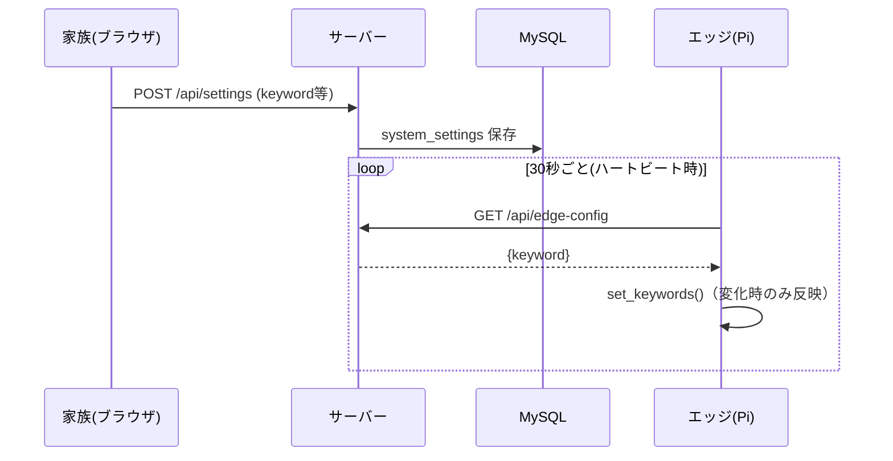

# 詳細設計書 — コエミマ

| 項目 | 内容 |
|---|---|
| バージョン | 2.0 |
| 更新日 | 2026-07-09 |

---

## 1. モジュール構成

### 1.1 エッジ（`edge/`）
| ファイル | 役割 |
|---|---|
| `app.py` | Flask（`/video`,`/command`）、認識フロー統括、サーバー送受信、音声再生、物理ボタン、ハートビート |
| `keyword_listener.py` | Vosk による STT。ウェイクワード検知・コマンド聞き取り |
| `image_processor.py` | Picamera2 撮影・NoIR補正・JPEG化 |

### 1.2 サーバー（`server/`）
| ファイル | 役割 |
|---|---|
| `main.py` | Flask アプリ本体。API・画面・エッジ連携・通知トリガ |
| `main_controller.py` | `MainController`：認証・登録・設定・ダッシュボードデータ |
| `ai_logic.py` | `processResponse`：Gemini 解析（構造化JSON） |
| `voice_handler.py` | `VoiceHandler`：VOICEVOX 音声合成（文単位ストリーム） |
| `database.py` | `DatabaseManager`：MySQL 操作 |
| `models.py` | SQLAlchemy モデル（User/RecognitionLog/NotificationHistory/SystemSetting） |
| `line_notifier.py` | `LineNotifier`：LINE 通知 |
| `mailer.py` | Gmail SMTP による認証コード送信 |

---

## 2. クラス図

> エッジの `app.py` はモジュール関数（`recognition_flow`, `send_and_play`, `heartbeat_check`, `fetch_keywords`, `setup_wake_button`, `wake_word_loop`）で構成し、`KeywordListener` と `ImageProcessor` を利用する。

---

## 3. 主要シーケンス

### 3.1 認識フロー（ウェイクワード→応答）
「基本設計書.md 6章」のシーケンス図を参照。

### 3.2 ログイン（メール2段階認証）

### 3.3 設定変更→エッジ反映

---

## 4. 主要処理の詳細

### 4.1 ウェイクワード照合（精度対策）
- **ノイズゲート**：`audioop.rms` で無音/過大入力チャンクを除外
- **正規化**：カタカナ→ひらがな、長音符・促音の除去
- **あいまい一致**：`difflib.SequenceMatcher` で類似度 0.82 以上を許容
- **partial検知**：`recognizer.PartialResult()` で発話途中でも検知
- **物理ボタン**：`wake_requested` フラグで音声を待たず即起動

### 4.2 音声合成ストリーミング
- `answer` を句点で文分割 → 文ごとに VOICEVOX 合成 → 4バイト長接頭辞付きフレームで逐次送信
- エッジは届いた文から `aplay` で再生（時間短縮）

### 4.3 緊急判定
- Gemini の `is_emergency` を `_emergency_flag()` で 0/1 に正規化（`1`/`"1"`/`true` を緊急扱い）
- 緊急時：LINE通知（`sendUrgentAlert`）＋ `notification_history` 保存
